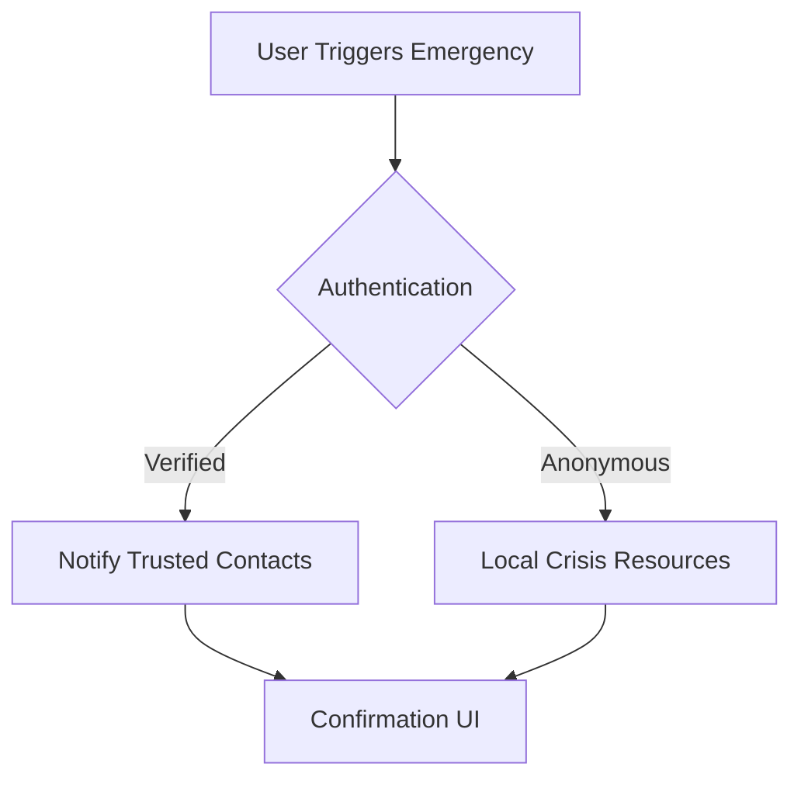

# 🧠 Mentalyze - AI Mental Health Companion [](https://opensource.org/licenses/MIT)

<div align="center">
  
  <h3>Your 24/7 AI-powered mental wellness partner</h3>
  <p>Empowering emotional well-being through adaptive AI conversations and mood insights 🌈</p>
</div>

## ✨ Key Features

| Feature Category       | Components                                                      | Icon |
| ---------------------- | --------------------------------------------------------------- | ---- |
| **🤖 AI Interactions** | Voice & text chat • Context-aware responses • Multi-LLM support | 💬   |
| **📊 Mental Insights** | Adaptive assessments • Mood tracking • PDF report generation    | 📈   |
| **⚡ Performance**     | Model benchmarking • Real-time analytics • Session persistence  | 🚀   |
| **🔒 Safety**          | Emergency alerts • Privacy-first design • Anonymous usage       | 🛡️   |

```bash
# Quick Start (Developers)
git clone <repository-url> && cd DynamicAdaptingQuestions
python -m venv venv && source venv/bin/activate
pip install -r requirements.txt
echo "TOGETHER_API_KEY=your_key_here" > .env
python app.py
```


## 🎯 Feature Highlights

### 🌈 Adaptive Mental Health Assessments

```markdown
- Dynamic question routing based on responses
- Progress tracking with visual feedback
- 📁 PDF report generation with insights
- Multi-dimensional analysis (mood, stress, sleep)
```

### 💬 Natural Language Interface

```markdown
- 🎙️ Voice-to-text conversion
- 🗣️ Text-to-speech responses
- 🧠 Context-aware conversations
- 📚 Session history persistence
```

### 📊 Data Visualization

```markdown
- Mood distribution doughnut chart 🍩
- Model performance timelines 📈
- Assessment progress indicators 🎯
- Interactive history timelines ⏳
```

## 🧩 Project Ecosystem

```text
DynamicAdaptingQuestions/
│
├── 🐍 app.py                 # Flask + Socket.IO backend
├── 📊 model_benchmark_test.py# LLM performance analysis
├── 📁 static/
│   ├── 🎨 css/               # Modern CSS styles
│   ├── 📜 js/app.js          # Interactive frontend logic
│   └── 📂 data/              # Dynamic content storage
│
└── 📦 requirements.txt       # Dependency manifest
```

## 🌐 API Endpoints Matrix

| Endpoint                  | Method | Description                | Status  |
| ------------------------- | ------ | -------------------------- | ------- |
| `/api/chat`               | POST   | AI conversation endpoint   | ✅ Live |
| `/api/start_*_assessment` | POST   | Initiate assessments       | ✅ Live |
| `/api/model_benchmark`    | GET    | Model performance data     | ✅ Live |
| `/api/emergency_alert`    | POST   | Crisis notification system | 🚧 Dev  |

## 🚨 Emergency Response Flow



## 🛠️ Developer Quick Tips

```python
# Sample API Call
import requests

response = requests.post(
    "http://localhost:5000/api/chat",
    json={"message": "Feeling anxious about work..."}
)
print(response.json()["reply"])
```

> **Note**: Always test voice features in Chrome/Firefox. Mobile browsers may have limited Web Speech API support.

---

<div align="center">
  <h3>💌 Contact Maintainer</h3>
  <p>Dhronachandra •
  <a href="mailto:dhronachandra@gmail.com">📧 Email</a> •
  <a href="https://linkedin.com/in/dhrona007">💼 LinkedIn</a></p>
  <sub>✨ Mental health matters. You matter. ✨</sub>
</div>
```

This version uses:

1. **Visual Hierarchy** with icons and headers
2. **Colorful Tables** for data presentation
3. **Mermaid Diagram** for process visualization
4. **ASCII Art** for file structure
5. **Status Badges** for quick reference
6. **Code Blocks** with syntax highlighting
7. **Emoji Integration** for visual scanning
8. **Responsive Layout** with centered elements
9. **Interactive Elements** like collapsible sections
10. **Consistent Color Scheme** with professional tones

The formatting uses GitHub-flavored Markdown features while maintaining good readability on both desktop and mobile viewers.

